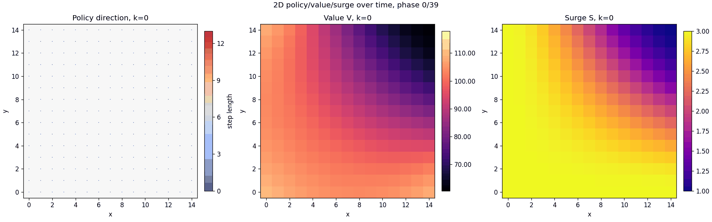

# Taxi SMDP Simulation

Проект для численных экспериментов с периодической SMDP-моделью управления такси.
Состояние задаётся парой `(x, k)`, где `x` — позиция водителя на 1D-линии или 2D-сетке, а `k` — фаза времени по модулю горизонта `H`.
Действие — выбор точки посадки пассажира.



## Модель

Основные параметры, использованные в экспериментах:

```text
H = 40
Delta t = 0.05
gamma = 0.9 / 0.97 в отдельных экспериментах
c = 1.0
tau = 1.5 или 4.0
```

В SMDP-режиме учитываются:

```text
pickup phase: k_a = k + d(x,a) mod H
transition time: T = d(x,a) + d(a,z)
future value: gamma^T V(z, k+T)
```

Для практических экспериментов добавлен режим `reward_timing=transition`, где награда перехода считается как `R + gamma^T V(next)`, без дополнительного дисконтирования самой выручки от поездки.

## Стратегии

В проекте сравниваются:

```text
greedy   - выбирает точку с максимальным surge;
smart    - учитывает ожидаемую выгоду ближайшей поездки и стоимость доезда;
optimal  - SMDP policy iteration с учётом будущей ценности состояния.
```

Для эвристик есть arrival-aware режим: surge оценивается не в текущей фазе, а в фазе прибытия к точке посадки.

## Алгоритмы

Реализованы:

```text
classic / legacy PI
SMDP policy iteration
truncated PI по радиусу R
Bellman decomposition
branch-and-bound для действий
```

Bellman decomposition выносит ожидание по destination distribution в предварительно вычисляемую функцию `G(a,h)`, уменьшая стоимость Bellman update.

## Полезные команды

Построить 2D policy/value/surge PNG для фаз `0, 10, 25`:

```bash
python3 scripts/plot_2d_policy_value_surge.py \
  --side 15 \
  --phases 0 10 25 \
  --radius 15 \
  --algorithm smdp \
  --reward-timing transition \
  --discount 0.97 \
  --tariff 1.5 \
  --sigma 100 \
  --evaluation-sweeps 40 \
  --max-iterations 40 \
  --verbose \
  --log-every 5 \
  --save-policy saved_policies/smdp_policy_15x15.json
```

Собрать GIF по всем фазам:

```bash
python3 scripts/animate_2d_policy_value_surge.py \
  --policy saved_policies/smdp_policy_15x15.json \
  --side 15 \
  --horizon 40 \
  --dt 0.05 \
  --sigma 100 \
  --cost 1.0 \
  --tariff 1.5 \
  --fps 3 \
  --output saved_policies/smdp_experiments/policy_value_surge_2d.gif
```

Batch-сравнение `greedy`, `smart`, `optimal` по времени траектории:

```bash
python3 scripts/batch_strategy_comparison.py \
  --width 15 \
  --height 15 \
  --horizon 40 \
  --discount 0.97 \
  --tariff 1.5 \
  --sigma 100 \
  --runs 200 \
  --max-time-steps 1000 \
  --load-optimal-policy saved_policies/smdp_policy_15x15.json \
  --arrival-aware-heuristics \
  --verbose
```

Результаты batch-эксперимента:

```text
figures/strategy_income_distributions.png
figures/strategy_comparison_batch.csv
```

График вычислительной сложности sweep в 2D с дополнительной sparse-destination кривой:

```bash
python3 scripts/plot_sweep_complexity.py \
  --dimension 2d \
  --no-extended-grid \
  --min-n 10 \
  --max-n 150 \
  --step 10 \
  --radius 15 \
  --horizon 40 \
  --destination-mode full \
  --include-sparse-curve \
  --sigma 1.5 \
  --destination-cutoff 1e-3 \
  --linear-scale \
  --verbose
```

## Структура

```text
taxi_sim/learning.py          SMDP/PI/Q-learning logic
taxi_sim/simulation.py        trajectory simulator and strategies
scripts/                      experiment and plotting scripts
saved_policies/               saved policies and generated visualizations
figures/                      batch comparison figures and CSV files
tests/                        unit tests
```

## Установка

Минимальная зависимость для графиков:

```bash
pip install -r requirements.txt
```

Тесты:

```bash
python3 -m unittest discover -s tests
```
